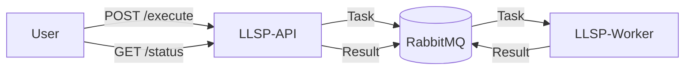

# LLSP Project

The LLSP (Long Lived Script Processors) is a distributed system designed to securely execute Python scripts via a RESTful API. It decouples submission from execution using a message queue, allowing for scalable processing of arbitrary code tasks.

## Architecture

The system consists of three main components:

-   **LLSP-API**: A FastAPI-backed web service that handles script submissions and status queries.
-   **Message Broker**: RabbitMQ serves as the communication layer between the API and workers.
-   **LLSP-Worker**: A Celery worker that picks up execution tasks, runs them in an isolated environment, and returns the results.



## Components

### LLSP-API
Located in `./LLSP-API`.
-   **Framework**: FastAPI.
-   **Responsibilities**:
    -   Receives Python scripts via JSON payload.
    -   Enqueues tasks to Celery.
    -   Provides execution status (Pending, Running, Success, Error).
    -   Exposes health and readiness probes.

### LLSP-Worker
Located in `./LLSP-Worker`.
-   **Framework**: Celery.
-   **Responsibilities**:
    -   Listens for script execution tasks.
    -   Executes scripts using `subprocess` in a temporary directory.
    -   Captures `stdout`, `stderr`, and exit codes.
    -   Returns execution artifacts to the backend.

## Getting Started

### Prerequisites
-   Docker
-   Docker Compose

### Running the System
You can start the entire stack using Docker Compose:

```bash
docker-compose up --build
```

This will spin up:
-   **RabbitMQ** (Management UI on port 15672)
-   **API** (Available at http://localhost:8000)
-   **Worker** (Background processing)

### Usage Example
Submit a script:
```bash
curl -X POST http://localhost:8000/execute \
  -H "Content-Type: application/json" \
  -d '{"script": "print(\"Hello World\")"}'
```

Check status:
```bash
curl http://localhost:8000/status/{task_id}
```

## Development

### Configuration & Linting
There is a `pyproject.toml` file in the root of this repository. Its primary purpose is to host the **shared configuration for Ruff** (linting and formatting).

While `LLSP-API` and `LLSP-Worker` have their own `pyproject.toml` files for defining their specific dependencies and build settings, the root `pyproject.toml` ensures that code style and quality rules are applied consistently across the entire project.

Run the following commands from the root directory to check the entire codebase:

```bash
# Lint all files
ruff check .

# Format all files
ruff format .
```

### Testing
End-to-end tests are located in `./tests`. You can run them using the test compose file:

```bash
docker-compose -f docker-compose.test.yml up --build --abort-on-container-exit
```
